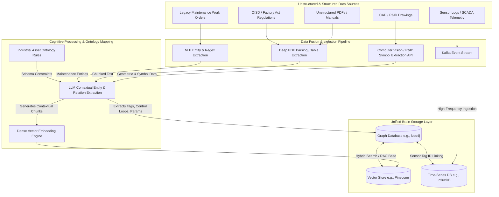

# Phase 1: Universal Document Ingestion & Knowledge Graph Pipeline (Engine A)

## 1. System Overview
Engine A acts as the foundational data ingestion and cognitive mapping layer. It transforms highly unstructured, multi-modal engineering data (CAD drawings, PDFs, text, telemetry) into a deterministic, queryable Knowledge Graph.

## 2. Ingestion & Cognitive Architecture

## 3. Technical Specifications

### A. Computer Vision for P&ID (Piping and Instrumentation Diagrams)
- **Model**: Custom-trained YOLOv8 for engineering symbol recognition paired with layout-aware OCR (e.g., Tesseract/AWS Textract).
- **Target**: Extracts equipment tags (e.g., `P-101`), valves, pipelines, and instrument bubbles, logging bounding box coordinates.

### B. NLP for Legacy Work Orders & Regulations
- **Pipeline**: SpaCy with custom NER (Named Entity Recognition) models trained on OISD guidelines and standard maintenance taxonomy.
- **Chunking Strategy**: Semantic chunking for regulations (chunking by clause/sub-clause) and tabular extraction for manuals.

### C. The Industrial Ontology Map
The Graph DB strictly enforces the following Node Types and relationships to prevent hallucination in downstream engines:
- `(Equipment)-[:MONITORS]->(Sensor)`
- `(Equipment)-[:APPEARS_IN]->(Document)`
- `(Equipment)-[:MAINTAINED_BY]->(WorkOrder)`
- `(Equipment)-[:GOVERNED_BY]->(Regulation)`
