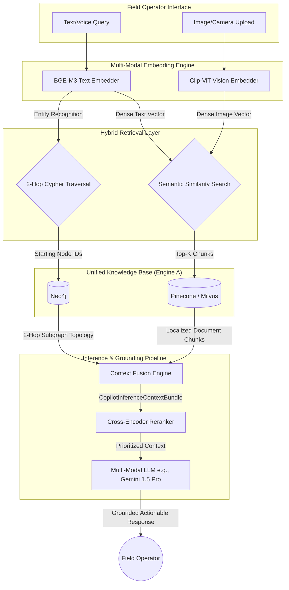

# Phase 2: Expert Field Knowledge Copilot (Engine B)

## 1. System Overview
Engine B is a multi-modal, context-aware Copilot designed for field operators. It leverages GraphRAG (combining Graph Database traversal with Vector semantic search) to provide hallucination-free, heavily grounded operational assistance based on manuals, real-time telemetry, and visual inputs.

## 2. Multi-Modal GraphRAG Architecture

## 3. Technical Specifications
- **BGE-M3**: Handles multi-lingual, multi-granularity textual queries (English, Hindi, regional dialects) for searching maintenance logs and OISD standards.
- **Clip-ViT**: Encodes field images (e.g., a photo of a leaking valve or a degraded pump seal) to cross-reference against stored schematic diagrams or previous defect photos in the VectorDB.
- **2-Hop Substructure**: Ensures that if a user asks about "Pump P-101", the LLM natively knows the upstream valve, downstream sensor, and active work orders without hallucinating connectivity.
