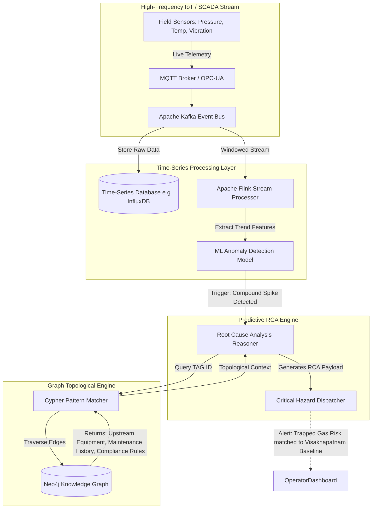

# Phase 3: Predictive Maintenance & RCA Cognitive Layer (Engine C)

## 1. System Overview
Engine C bridges high-frequency IoT/SCADA sensor telemetry with the contextual topology of the Neo4j Knowledge Graph (established in Engine A). This synthesis enables the proactive detection of compound operational hazards—correlating live data anomalies with historical maintenance records and cascading equipment dependencies.

## 2. SCADA-Graph Bridge Architecture

## 3. Operational Workflow
1. **Streaming Anomaly Detection**: Sensor streams are monitored by Flink in sliding windows. Instead of simple thresholds, ML models (Autoencoders/Isolation Forests) detect multivariate deviations.
2. **Context Trigger**: When a `Gas Pressure Anomaly` is detected on `TAG-PT-809`, the system fires a GraphQL/Cypher query to Neo4j.
3. **Compound Risk Identification**: Neo4j traverses 2-hops from the sensor. It identifies:
   - The primary vessel `EQ-STYRENE-TANK-1`.
   - The downstream relief valve `EQ-PRV-810`.
   - The historical work order `WO-2022-192` showing the relief valve was flagged for deferred maintenance.
4. **RCA Generation**: The RCA Reasoner synthesizes the sensor spike with the deferred maintenance node to classify the hazard as an imminent Vapor Cloud Ignition risk, correlating it with historical Visakhapatnam incidents.
