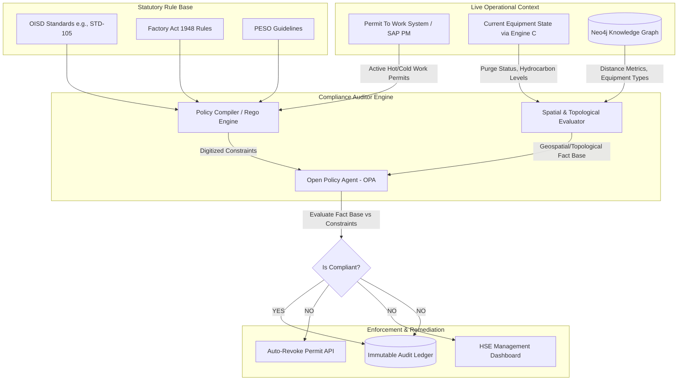

# Phase 4: Quality, Factory Act, & OISD Regulatory Compliance Auditor (Engine D)

## 1. System Overview
Engine D introduces an automated, continuously running regulatory auditing layer. It evaluates active operational states (from Engine C), knowledge graph topography (from Engine A), and live Permit to Work (PTW) data against digitized statutory constraints, acting as an autonomous compliance enforcement mechanism.

## 2. Compliance Evaluation Flow Architecture

## 3. Operational Logic Workflow
1. **Fact Gathering**: Whenever a Hot Work Permit is requested or goes active in the PTW system, Engine D ingests the geo-coordinates of the permit execution zone.
2. **Spatial Graph Traversal**: The Engine queries the GraphDB to identify all volatile storage tanks or process equipment within a 15-meter radius (a standard hot work constraint).
3. **State Evaluation**: The system polls the active state of those nearby assets. If an asset is flagged as "UNPURGED" or containing active hydrocarbons, the facts are passed to the Open Policy Agent (OPA).
4. **Policy Enforcement**: OPA evaluates the digitized OISD-STD-105 constraint. Given the facts (Hot Work within 15m of Unpurged Tank), the policy evaluates to a `CRITICAL_VIOLATION`.
5. **Remediation Action**: Engine D immediately dispatches a webhook to the PTW system to auto-suspend the permit and logs an immutable entry in the safety ledger.
