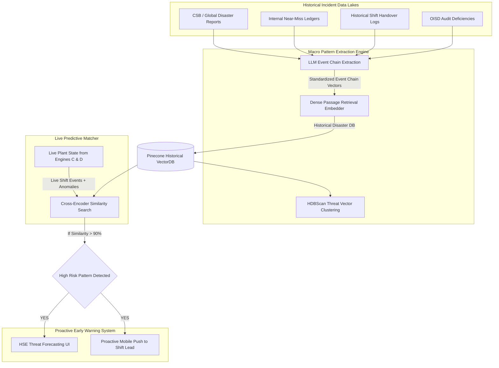

# Phase 5: Historical Incident Pattern & Lessons Learned Predictive Engine (Engine E)

## 1. System Overview
Engine E acts as the macro-level foresight layer of the Unified Asset Brain. It shifts focus from reactive telemetry monitoring (Engine C) and static compliance checking (Engine D) into proactive threat forecasting. By continuously mapping live operational states against a massive corpus of global industrial disasters, near-miss ledgers, and shift logs, it surfaces predictive warnings before a critical sequence converges into an incident.

## 2. Incident Pattern Intelligence Architecture

## 3. Operational Logic Workflow
1. **Continuous Corpus Ingestion**: Reports of major industrial disasters (like Bhopal, Visakhapatnam, Texas City) and local near-misses are ingested, parsed for causal event chains by an LLM, and stored as dense vectors in the Historical VectorDB.
2. **Cluster Formation**: HDBScan clusters similar historical failures together (e.g., "Shift Handover Communication Failures + Unacted Pressure Spikes").
3. **Live State Polling**: The Similarity Engine polls current operational states (e.g., alarms firing during shift changeovers) synthesized from Engine C and D.
4. **Predictive Matching**: If the live vector trajectory closely aligns (e.g., > 90% cosine similarity) with a historical disaster cluster, Engine E flags the sequence as a pre-incident pattern and pushes immediate mitigation strategies to the operations team before physical limits are breached.
