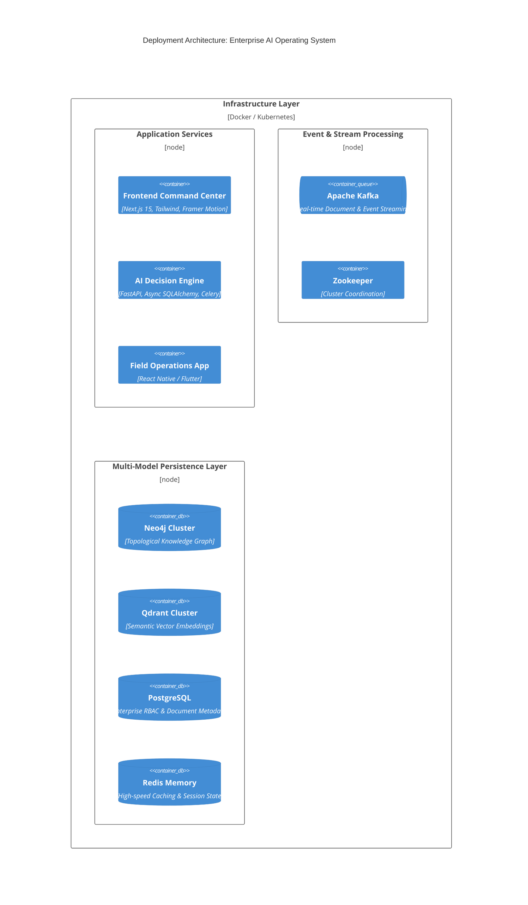

# Industrial AI Operating System (Unified Asset & Operations Brain)

[](https://github.com/om-prakash16/ET-Hackton)
[](https://nextjs.org/)
[](https://fastapi.tiangolo.com/)
[](https://neo4j.com/)
[](https://kafka.apache.org/)

An enterprise-grade **Decision Intelligence Engine** and **Unified Operational Brain** for asset-intensive industries (Oil & Gas, Manufacturing, Energy). Designed to eliminate data silos by combining **GraphRAG** (Topological Knowledge Graphs via Neo4j) with **Vector Semantic Retrieval** (Qdrant) and **Event-Driven Ingestion** (Kafka).

---

## 🌟 Key Features

### 1. 🧠 Unified Operational Brain (Executive Command Center)
- **Live Asset & Telemetry Monitoring**: Real-time visibility into total assets, graph topology nodes, and plant compliance status.
- **AI Triage Inbox**: Immediately surfaces critical anomalies (e.g., centrifugal pump pressure drops) and links them directly to telemetry and historical maintenance records.
- **Active Ingestion Stream**: Live visual feed of document ingestion, chunking, and embedding generation across Kafka and vector stores.

### 2. 🕸️ Universal Document Intelligence & Knowledge Graph
- **Automated Extraction**: Ingests OEM manuals (API-610), P&ID DWG files, safety regulations (OISD-105), and unstructured maintenance logs.
- **Topological Asset Mapping**: Recognizes physical equipment entities and constructs an active knowledge graph connecting equipment, failure modes, procedures, and historical incidents.
- **Interactive Graph Inspector**: Visualize physical asset dependencies and document citations side-by-side.

### 3. 🤖 GraphRAG Diagnostic Copilot
- **Zero-Hallucination Retrieval**: Combines semantic vector search with multi-hop Neo4j graph traversal to answer complex diagnostic engineering queries.
- **Interactive Evidence & Provenance**: Every LLM response includes clickable citations that highlight exact paragraphs and diagrams from source OEM manuals with confidence scores.

### 4. 🔧 Automated Root Cause Analysis (RCA) & Maintenance
- **Instant Fault Trees**: Automatically generates root cause trees combining real-time symptoms, probable mechanical failures, and historical maintenance errors.
- **Actionable Recommendations**: Transforms catastrophic failure risks into scheduled preventative maintenance workflows and work orders.

### 5. 🛡️ Regulatory Compliance & Audit
- **Continuous Compliance Tracking**: Continuously maps operational reality against safety frameworks (Factory Act, OISD-105).
- **Violation Alerting**: Flags missed inspection intervals and safety mismatches with one-click mitigation workflows.

### 6. 📱 Mobile & Edge Operations
- **Cross-Platform Support**: Built-in mobile applications (React Native & Flutter) for on-site field engineers to inspect assets, perform OCR on equipment tags, and access offline diagnostic support.

---

## 🏗️ System Architecture



---

## 🚀 Quick Start (Docker Compose)

The easiest way to launch the entire multi-database infrastructure locally is via Docker Compose.

### Prerequisite
- [Docker & Docker Desktop](https://www.docker.com/products/docker-desktop/) (v24+ recommended)
- [Node.js](https://nodejs.org/) (v20+)
- [Python](https://www.python.org/) (v3.11+)

### 1. Launch Infrastructure Services
Spin up **Neo4j**, **Qdrant**, **Kafka**, **Zookeeper**, and **Redis**:

```bash
docker compose -f docker/docker-compose.yml up -d
```

Verify all services are healthy:
```bash
docker ps
```
*Expected running ports:*
- **Neo4j**: `7474` (HTTP Browser), `7687` (Bolt Protocol) — *Default credentials: `neo4j` / `password`*
- **Qdrant**: `6333` (REST API), `6334` (gRPC)
- **Kafka**: `9092`
- **Zookeeper**: `2181`
- **Redis**: `6380`

---

## 💻 Local Development Setup

### 1. Frontend Command Center (Next.js)
Navigate to the frontend directory and configure your environment:

```bash
cd frontend
cp .env.example .env.local # If available, or create .env.local
```
Add your Gemini API Key in `frontend/.env.local` for streaming AI responses:
```env
GEMINI_API_KEY=your_gemini_api_key_here
```

Install dependencies and run the development server:
```bash
npm install
npm run dev
```
🌐 Open **[http://localhost:3001](http://localhost:3001)** (or `localhost:3000`) in your browser to view the Command Center.

### 2. Backend AI Engine (FastAPI)
Navigate to the backend directory and set up a Python virtual environment:

```bash
cd backend
python -m venv venv
# On Windows:
.\venv\Scripts\activate
# On Linux/macOS:
source venv/bin/activate

pip install -r requirements.txt
```

Run database migrations/initialization and start the FastAPI server:
```bash
uvicorn app.main:app --reload --host 0.0.0.0 --port 8000
```
📚 API Documentation will be available at **[http://localhost:8000/docs](http://localhost:8000/docs)**.

---

## 📂 Repository Structure

```text
├── backend/                  # FastAPI Decision Engine & Workers
│   ├── app/
│   │   ├── ai/               # LLM, GraphRAG, and Prompt Pipelines
│   │   ├── domains/          # Domain-driven modules (Copilot, Ingestion, Auth, Maintenance)
│   │   ├── models/           # SQLAlchemy ORM Models
│   │   ├── services/         # Neo4j, Qdrant, and Embedding services
│   │   └── workers/          # Background document processing workers
│   └── alembic/              # Database migration scripts
├── docker/                   # Docker Compose infrastructure configs
├── docs/                     # System architecture & deployment diagrams
├── frontend/                 # Next.js 15 Enterprise Command Center UI
│   └── src/
│       ├── app/              # Next.js App Router pages
│       ├── components/       # Reusable UI & Glassmorphic components
│       └── features/         # Feature modules (Dashboard, Copilot, Compliance, Documents)
├── mobile/                   # React Native mobile application for field engineers
├── mobile_flutter/           # Flutter cross-platform mobile application
└── scripts/                  # Database seed scripts & utilities
```

---

## 📈 Business Impact
- **60% MTTR Reduction**: Dramatically shortens Mean Time to Resolution by connecting engineers instantly to root-cause telemetry and OEM documentation.
- **Automated Audit Readiness**: Replaces weeks of manual regulatory compliance checks with real-time graph topology verification.
- **Tribal Knowledge Preservation**: Captures expert diagnostic workflows into a permanent, queryable enterprise graph.

---

## 📄 License
This project is developed for the ETI Hackathon (Problem Statement #8: Unified Asset & Operations Brain). All rights reserved.
