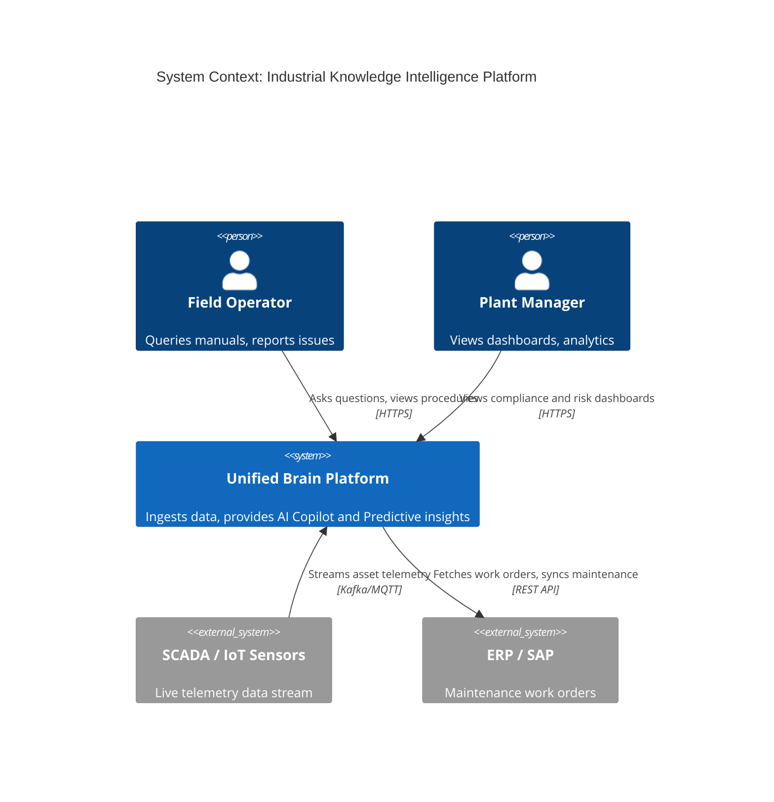
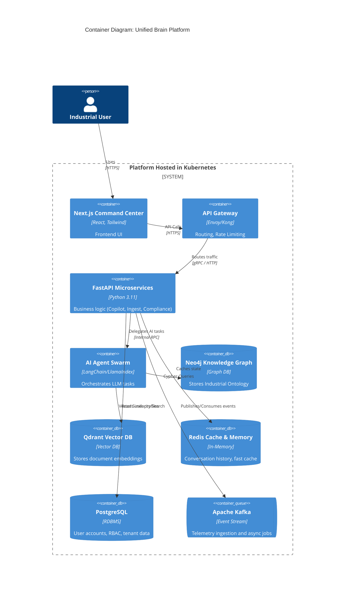
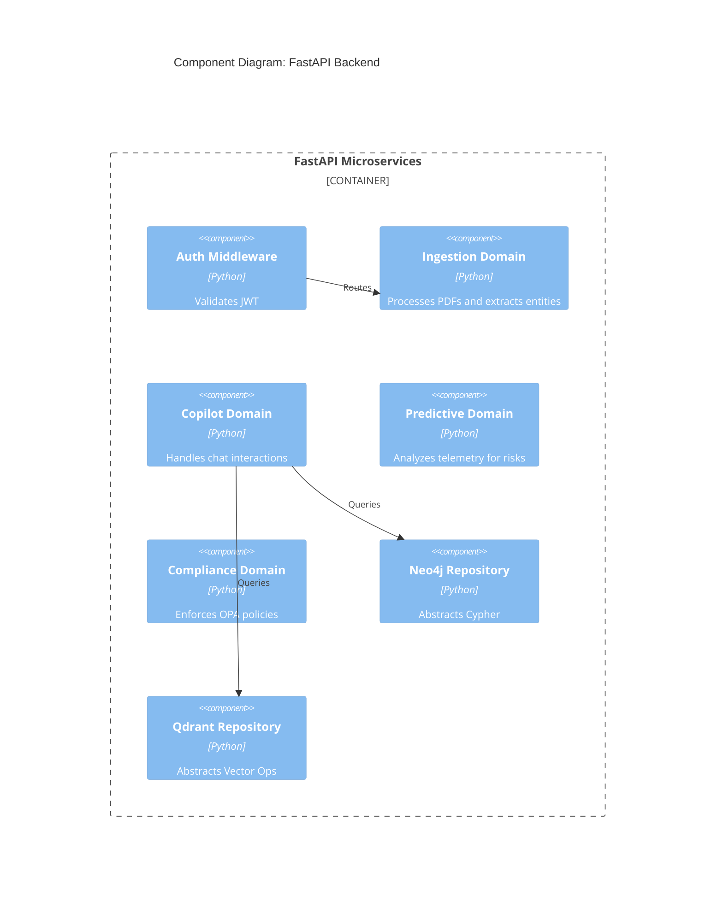

# C4 Architecture Diagrams

## 1. System Context Diagram
Shows the high-level interactions between user personas and external systems.

## 2. Container Diagram
Shows the high-level technical containers that make up the system.

## 3. Component Diagram (Backend API)

