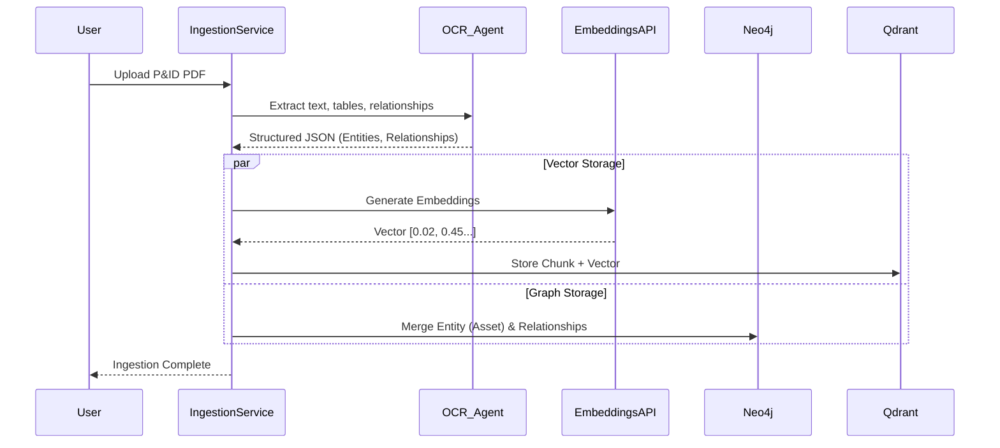
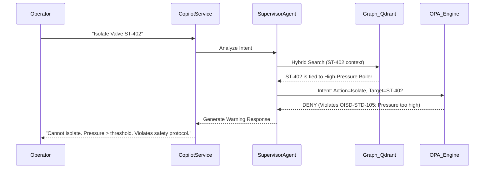
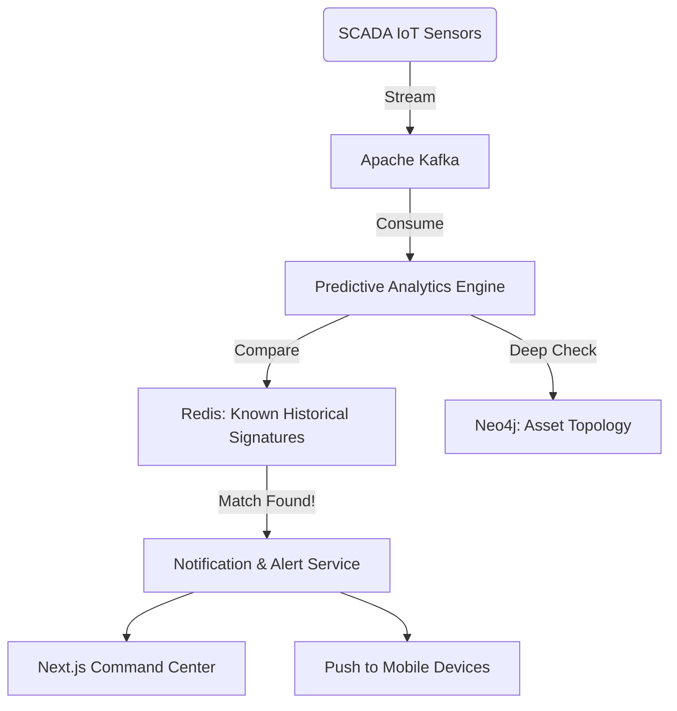

# Data Flow Diagrams

## 1. Document Ingestion Flow (Engine A)

```mermaid
sequenceDiagram
    participant User
    participant IngestionService
    participant OCR_Agent
    participant EmbeddingsAPI
    participant Neo4j
    participant Qdrant

    User->>IngestionService: Upload P&ID PDF
    IngestionService->>OCR_Agent: Extract text, tables, relationships
    OCR_Agent-->>IngestionService: Structured JSON (Entities, Relationships)
    
    par Vector Storage
        IngestionService->>EmbeddingsAPI: Generate Embeddings
        EmbeddingsAPI-->>IngestionService: Vector [0.02, 0.45...]
        IngestionService->>Qdrant: Store Chunk + Vector
    and Graph Storage
        IngestionService->>Neo4j: Merge Entity (Asset) & Relationships
    end

    IngestionService-->>User: Ingestion Complete
```

## 2. Copilot GraphRAG Inference Flow (Engine B & D)

```mermaid
sequenceDiagram
    participant Operator
    participant CopilotService
    participant SupervisorAgent
    participant Graph_Qdrant
    participant OPA_Engine
    
    Operator->>CopilotService: "Isolate Valve ST-402"
    CopilotService->>SupervisorAgent: Analyze Intent
    
    SupervisorAgent->>Graph_Qdrant: Hybrid Search (ST-402 context)
    Graph_Qdrant-->>SupervisorAgent: ST-402 is tied to High-Pressure Boiler
    
    SupervisorAgent->>OPA_Engine: Intent: Action=Isolate, Target=ST-402
    OPA_Engine-->>SupervisorAgent: DENY (Violates OISD-STD-105: Pressure too high)
    
    SupervisorAgent-->>CopilotService: Generate Warning Response
    CopilotService-->>Operator: "Cannot isolate. Pressure > threshold. Violates safety protocol."
```

## 3. Background Telemetry Flow (Engine C & E)

```mermaid
flowchart TD
    SCADA(SCADA IoT Sensors) -->|Stream| Kafka[Apache Kafka]
    Kafka -->|Consume| PredictiveService[Predictive Analytics Engine]
    
    PredictiveService -->|Compare| RedisCache[Redis: Known Historical Signatures]
    PredictiveService -->|Deep Check| Neo4j[Neo4j: Asset Topology]
    
    RedisCache -- Match Found! --> AlertEngine[Notification & Alert Service]
    AlertEngine --> UI[Next.js Command Center]
    AlertEngine --> Webhook[Push to Mobile Devices]
```
