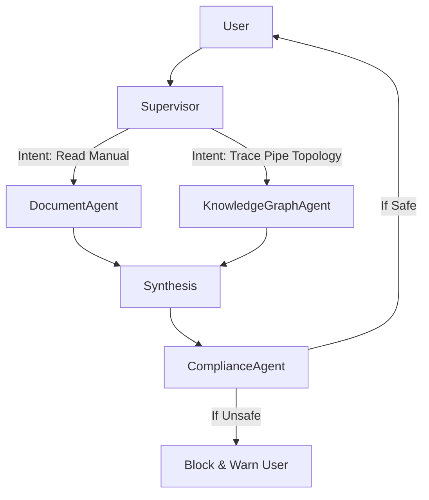

# AI Agent Architecture

Instead of a single monolithic LLM prompt, the system utilizes a **Multi-Agent Orchestration Framework** (similar to LangGraph or AutoGen).

## 1. Supervisor Agent
- **Role**: The orchestrator. Receives user input, determines intent, and routes to specialized sub-agents.
- **Tools**: Router logic, intent classification.

## 2. Document Agent (RAG)
- **Role**: Specialized in searching Qdrant for semantic matches inside maintenance manuals.
- **Tools**: Qdrant Semantic Search tool.

## 3. Knowledge Graph Agent
- **Role**: Specialized in translating natural language to Cypher queries to interrogate the Neo4j ontology.
- **Tools**: Text-to-Cypher translator, Neo4j execution tool.

## 4. Compliance Agent
- **Role**: Validates any proposed action against safety standards using the Open Policy Agent (OPA).
- **Tools**: OPA Evaluation Engine.

## 5. Flow of Execution

