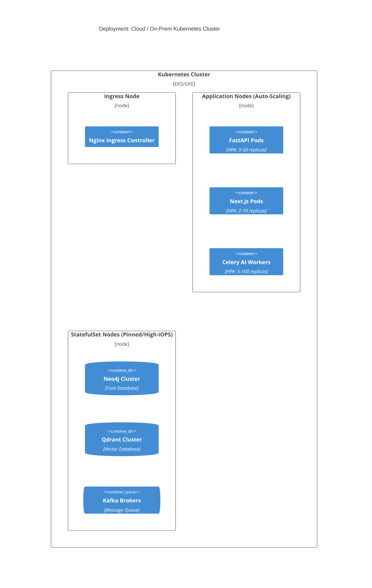

# Deployment Architecture

The platform uses a Kubernetes-native deployment strategy designed for either Cloud (GCP/AWS/Azure) or On-Premise Air-Gapped execution (for strict industrial environments).

## 1. Local Development
- Handled exclusively via `docker-compose.yml`.
- Spins up Neo4j, Qdrant, Redis, Kafka, and Zookeeper alongside the FastAPI application locally.

## 2. Kubernetes Architecture (Production)

## 3. CI/CD Pipeline
- **GitHub Actions**: Triggers on `main` branch merges.
- **Pipeline Flow**: `Linting` -> `PyTest (Unit)` -> `Testcontainers (Integration)` -> `Docker Build` -> `Helm Upgrade`.
- **Zero-Downtime**: Helm implements rolling updates to ensure operators never lose Copilot connectivity.
