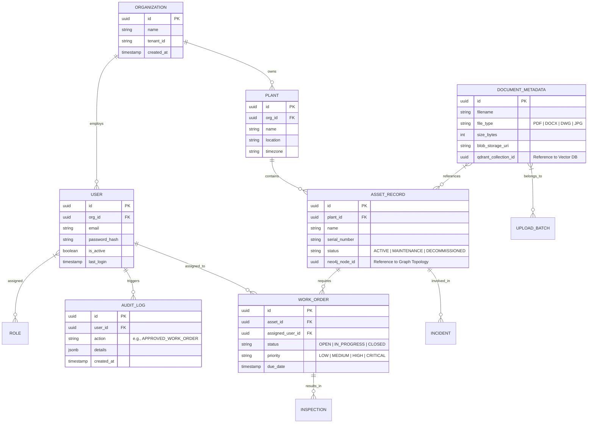

# PostgreSQL Relational Architecture & ER Diagram

PostgreSQL acts as the transactional backbone of the Industrial Data Platform. It stores highly structured data such as Users, RBAC, Organizations, Audit Logs, and strict Maintenance tasks that require ACID guarantees. 

*Note: The physical topology of assets and unstructured text are stored in Neo4j and Qdrant respectively. PostgreSQL only stores the UUID references to those entities.*

## 1. Entity Relationship Diagram

## 2. Table Design Strategies
- **Primary Keys**: UUIDv7 for sequential sorting and global uniqueness across the distributed fleet.
- **Soft Deletes**: Every table contains `deleted_at (timestamp)`. Queries enforce `deleted_at IS NULL`.
- **JSONB**: Used extensively in `AUDIT_LOG` and `DOCUMENT_METADATA` for flexible schemas without breaking relational constraints.
- **Foreign Key Indexing**: Every FK is explicitly indexed to prevent full-table scans during JOIN operations.
