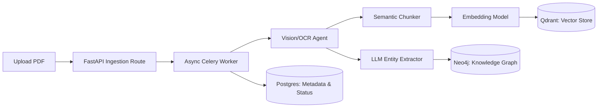

# Data Platform Architecture (Overview)

The Industrial Data Platform is the bedrock of the Unified Asset & Operations Brain. It seamlessly blends three specialized data persistence paradigms to solve the unique challenges of industrial operations.

## 1. The Tri-Store Paradigm

1. **The Vector Store (Qdrant)**: Answers "What does this text *mean*?"
   - Handles the fuzziness of human language, OCR extractions, and massive maintenance manuals.
2. **The Graph Store (Neo4j)**: Answers "How is this *connected*?"
   - Handles the rigid laws of physics and topology. (e.g., Fluid cannot flow from A to B if Valve C is closed).
3. **The Relational Store (PostgreSQL)**: Answers "Who *owns* this and what is the *audit trail*?"
   - Handles strict regulatory compliance, user access, and state tracking.

## 2. Data Synchronization (The Challenge)
Keeping three databases perfectly synchronized is a complex distributed systems problem.
- **Solution**: The platform utilizes **Apache Kafka** and the Outbox Pattern.
- When an asset is deleted via the API, PostgreSQL deletes the record and commits an event to a Kafka topic `asset.deleted`.
- Neo4j and Qdrant consume this topic and apply the corresponding deletions asynchronously. This guarantees eventual consistency without dragging down the API response time with distributed two-phase commits.

## 3. Data Ingestion Pipeline Architecture

